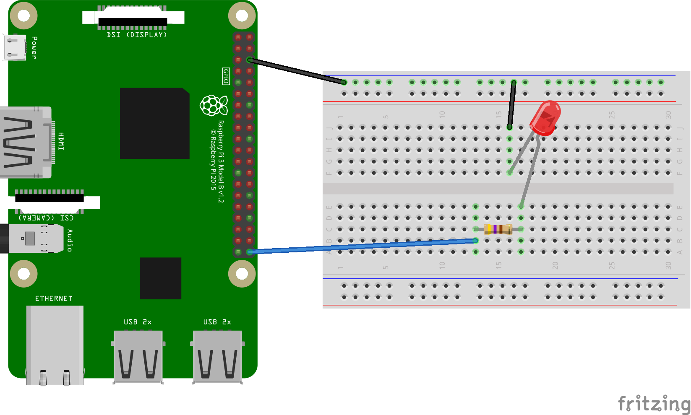

HelloThings
=============================

A simple Android Things example that blink the LED by Raspberry Pi 3

For Taiwanese, you can see Traditional Chinese turorial here: [Android Things 學習筆記: GPIO 的輸出控制](https://coldnew.github.io/468144f4)

Pre-requisties
----------------
- Raspberry Pi 3
- Android Studio 2.2+
- 1 LED
- 1 150ohm resistors
- 1 breadboard
- jump wires

Schematics
----------------



Build and install
=================

On Android Studio, click on the "Run" button.

If you prefer to run on the command line, type

```bash
./gradlew installDebug
adb shell am start com.example.coldnew.hellothings/.MainActivity
```

If you have everything set up correctly, the LED will start blinking.
